---
# ToDo
# Aula rápida, tipo 15 minutos
# Começar com a filogenia dos Bryozoa (Lophophorata)

title: "Introdução aos Bryozoa (Lophophorata)"
institute: "Prof. Maurício Garcia de Camargo"
author: "Disciplina: Biodiversidade de Invertebrados Marinhos - IO-FURG"
date: 2026-05-14
#date: "`r Sys.Date()`" #Para funcionar tem que ter o `r Sys.Date()` em qualquer lugar do corpo (atualmente está no footer do primeiro slide)
lang: pt-br
title-slide-attributes:
  data-background-color: "#6b5a59"
format: 
  revealjs:
    #Veja outros temas em https://quarto.org/docs/presentations/revealjs/themes.html
    theme: [serif, MeuCustom.scss]
#    logo: images/furg4.png
#    footer: "`Reprodutibilidade científica`"
    slide-number: true
    chalkboard: true #Muito bom para aula
#    multiplex: false #Os alunos podem seguir com smartfone. ToDo.
#    show-slide-number: all
    controls: true #Não é menu. ToDo.
#    css: [assets/sydney.css, assets/sydney-fonts.css]
    #Sem estes css o :::box não funciona
    css: [assets/syntax-highlight.css, assets/sydney.css, assets/custom.css, assets/sydney-fonts.css]
---

## Lophophorata dentro dos Metazoa {.smaller .scrollable}

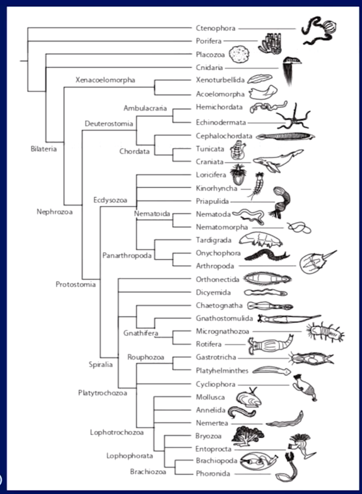{width="800" height="800"}

## Notas sobre a filogenia dos Lophophorata

O clado Lophophorata inclui os filos:

-   Ectoprocta (Bryozoa): ânus fora da corôa de tentáculos.

-   Entoprocta: ânus interno à corôa de tentáculos.

-   Brachiopoda e Phoronida: muitos registros fósseis.

::: {.incremental}

-   Muitos são coloniais.

-  Às vezes parecem plantas ou corais.

-  São bentônicos e filtradores.

-  A sinapomorfia do grupo é a presença de **lofóforo**.

::: 

## Lofóforo {.smaller}

-   `Lofóforo` é uma estrutura tentacular em forma de anel ao redor da boca que serve para alimentação, possuindo origem no celoma.
-   Os tentáculos possuem cílios que provocam uma corrente de água que leva partículas nutritivas para a boca e participam das trocas gasosas.

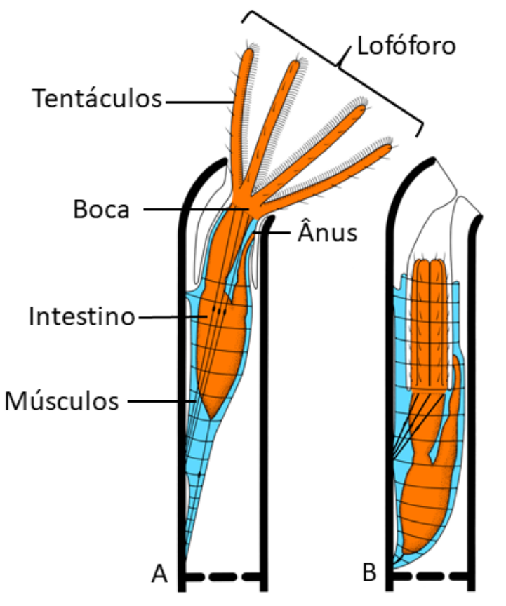{fig-align="\"center"}

## Filo Bryozoa (colonial)

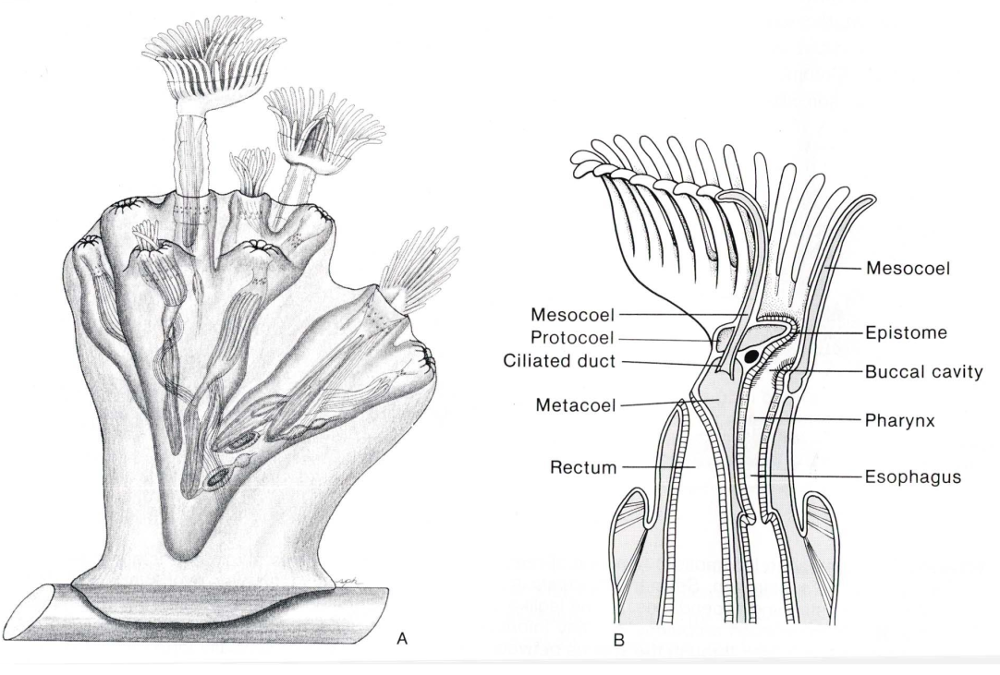

## Filo Bryozoa - Diversidade

::: {layout="[[1,1,1], [1,1,1]]"}
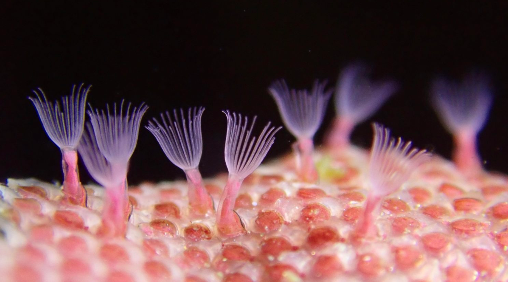

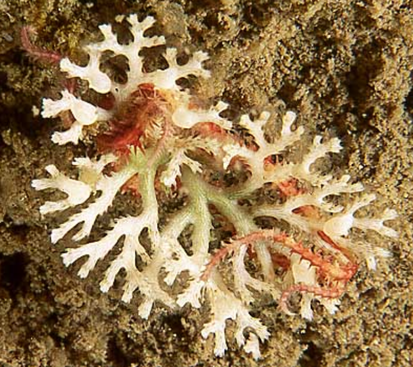

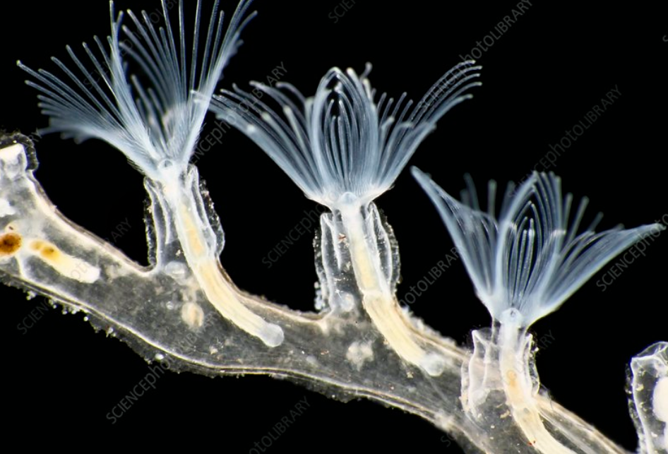

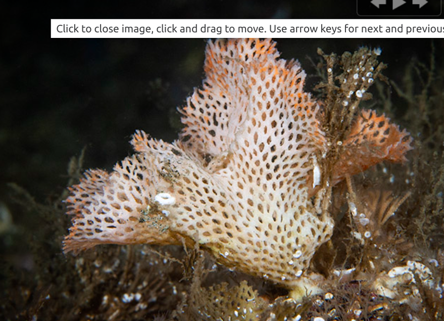

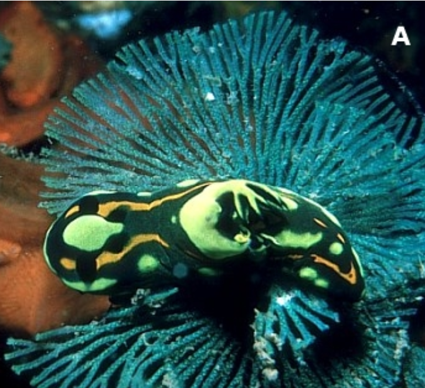

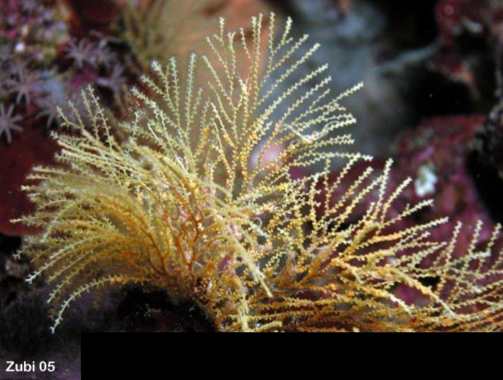
:::

## Filo Bryozoa {.smaller}

 

::: {.incremental}

-   Briozoários se fixam em substratos duros, como pedras e conchas, a partir da larva **cifonauta**, em ambiente de água doce e marinho.
-   Cerca de 8 mil espécies.
-   Colônias de briozoários servem de abrigo e são fonte de alimento para muitos organismos.
-   Briozoários são importantes bioincrustadores, atacando estruturas de concreto e madeira.
-   São filtradores não seletivos (fito + zooplâncton) e podem fixar carbono atmosférico.

:::

## Reprodução

São hermafroditas, que se reproduzem de maneira sexual e assexuada, com fertilização interna e desenvolvimento indireto, com larva **cifonauta**.

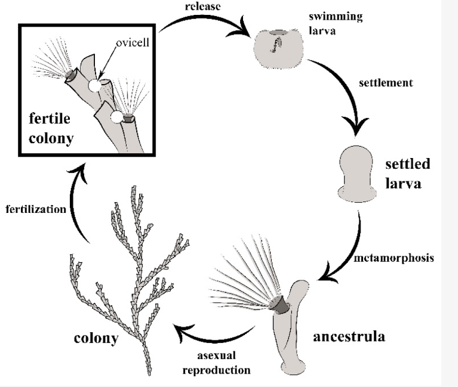{fig-align="\"center"}

## Sistemas de Bryozoa {.smaller}

-   Sistema digestivo - É o sistema mais completo dos briozoários, ocupando praticamente todo o interior do corpo do animal, em forma de tubo em U. Composto por boca, que se abre no centro do lóforo, faringe e esôfago muito curto, que se abre para o estômago.

{fig-align="\"center"}

## Sistemas de Bryozoa {.smaller}

::: {.incremental}

-   Sistema nervoso Muito rudimentar. Consiste em um único nó nervoso localizado acima do esôfago e conectado a um anel que se estende ao redor da faringe. Desse gânglio, emergem fibras nervosas que são distribuídas por todo o corpo do animal.

-   Nutrição Os briozoários são suspensivos, se alimentando das partículas em suspensão na água (fito e zooplâncton).

-   O lofóforo é responsável por redirecionar os fluxos de água para a boca do animal. O muco secretado pelos tentáculos dos lofóforos contribui e facilita a alimentação, capturando os alimentos e os movem para a boca.

:::

## Bryozoa da praia do Cassino

*Membraniporopsis tubigera*

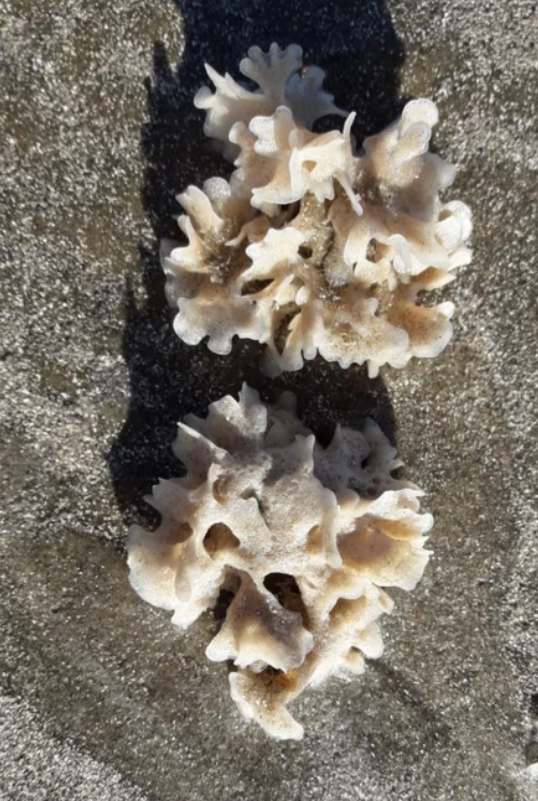{fig-align="\"center"}

## Bryozoa na praia do Cassino

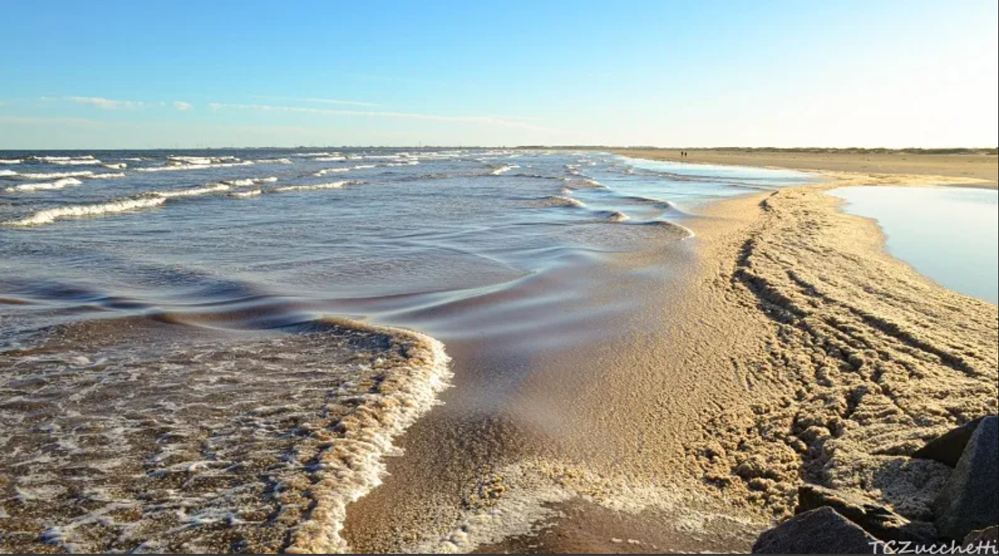{fig-align="\"center"}
