## Taxonomia, classificação  e sistemática {.smaller}

:::{.notes}
1. Perguntar bastante sobre taxonomia, sem passar os slides.   
2. Começar: tem livros de sistemática, até em pt.
3. Taxonomia sempre foi um bicho-papão para os Oceanógrafos (rivalidade com os Biólogos).  
4. Taxonomia não é apenas a parte chata da história.
:::

<br>  

> "A **taxonomia** descreve a biodiversidade, a **classificação** procura algum tipo de ordem e a **sistemática** apresenta um sistema geral de referência (Amorim, 2005)."[^1]


<br>

::: {.fragment fragment-index=1}
-   A **Taxonomia** descreve, nomeia e classifica os seres vivos.  
:::

::: {.fragment fragment-index=2}
-  É um trabalho minucioso, mas gratificante.
:::

[^1]: 
AMORIM, D. S. Fundamentos de sistemática filogenética. Ribeirão Preto: Holos, 2005.
:::

<!------- ############### sd ############### -------->

## O trabalho do taxonomista é na lupa e no microscópio
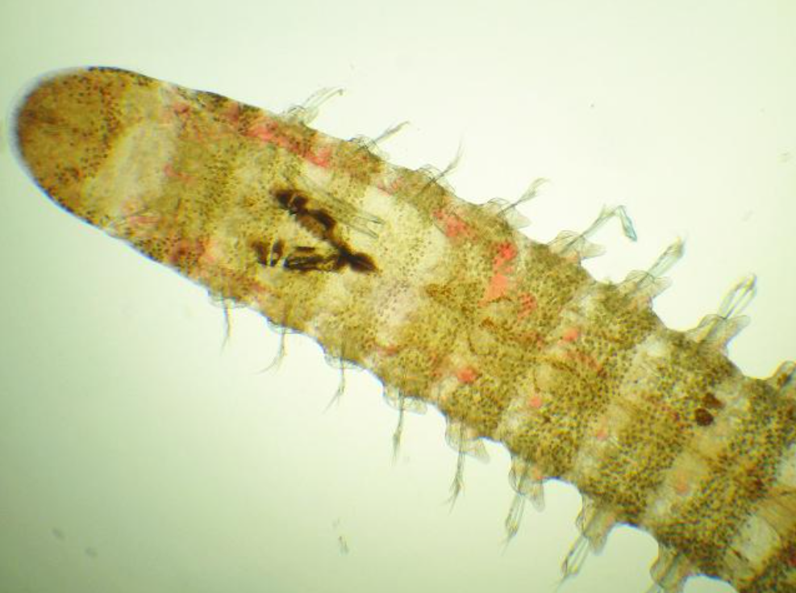


## O trabalho de identificação de espécies envolve exame detalhado das estruturas.


<!------- ############### sd ############### -------->
## Taxonomia, classificação  e sistemática {.smaller}

:::{.notes}
Em **Classificação**, propor uma classificação para os indivíduos da turma.  

Falar da sistemática clássica e dos parâmetros morfológicos de Lineu. 
:::

:::box
"A **taxonomia** descreve a biodiversidade, a **classificação** procura algum tipo de ordem e a **sistemática** apresenta um sistema geral de referência (Amorim, 2005)."
:::


> -   **Taxonomia** descrever, nomear e classificar os seres vivos.  
-   A **classificação** separa os organismos em grupos, baseado num conjunto de *critérios (ou parâmetros)* pré-estabelecidos.
-   **Sistemática** é um sistema de classificação biológica. Cada sistema de classificação depende dos parâmetros escolhidos, e os parâmetros mudaram ao longo da história.

:::{.fragment}
> Lineu criou a sistemática clássica, baseada em parâmetros **morfológicos** para agrupar a hierarquia de táxons (= unidade taxonômica). 
:::

<!------- ############### sd ############### -------->
## Parâmetros de classificação da biodiversidade {.smaller}

:::{.notes}
Linha do tempo  
< 4000 aC (alfabeto) - Pré-história  
Até 476 dC (fim de Roma) - Idade antiga  
Até 1453 (queda de constantinopla) - Idade média  
Até 1789 (rev. franc) - Idade moderna  
Até hoje - Idade Contemporânea
:::

<br>

> **Parâmetros mudaram ao longo da história**  

<br>

:::: {.columns}
::: {.column width="50%"}

-   **1. Sistemática antiga**
    - Aristóteles (400 aC)  
    - Parâmetros intuitivos

<br>

-   **2. Sistemática clássica**  
(*Systema naturae* )
    - Linneaus (1758)
    - Parâmetros morfológicos

:::
::: {.column width="50%"}
-   **3. Sistemática evolutiva**
    - Darwin (1858)
    - Parâmetros evolutivos

<br>

-   **4. Sistemática filogenética = cladística**
    - Hennig (1966)
    - Parâmetros evolutivos e filogenéticos

:::
::::

::: footer
```{r}
# Fake: serve só para que a data apareça no primeiro slide
ss=Sys.Date()
```
:::


## {background-color="#6b5a59"}

<br><br><br><br>

::: {.r-fit-text}
Sistemática antiga de Aristóteles
:::

<!------- ############### sd ############### -------->
## Aristóteles (400 a.C.) e a sistemática biológica intuitiva

:::{.notes}
Criança de 8 anos. 
:::

- Conhecia apenas o mundo macroscópico  
- Em *Historia animalium* descreveu 500 espécies. 

:::: {.columns}
::: {.column width="20%"}
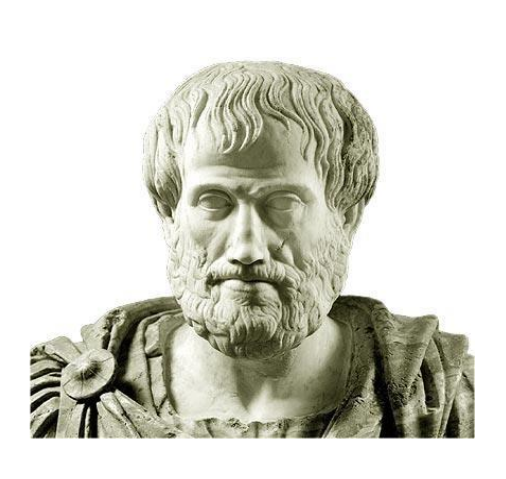
:::
::: {.column width="32%"}
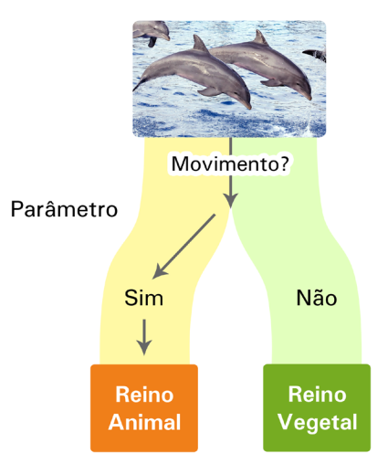
:::
::: {.column width="48%"}
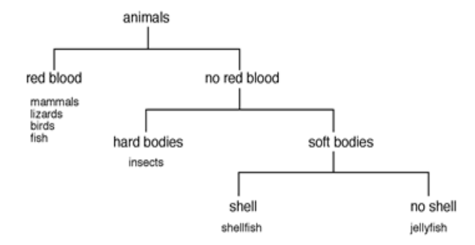
:::
::::


## {background-color="#6b5a59"}

<br><br><br><br>

::: {.r-fit-text}
Sistemática clássica de Linneaus
:::

<!-------################# sd #################-------->
## Carolus Linneaus (ou Lineu ou só L.) e o "*Systema naturae*" (1758)  {.smaller}

As edições da obra de Lineu podem ser encontradas em: <https://www.biodiversitylibrary.org/page/728487#page/1/mode/1up>

- Antes de Lineu:
    - Descrição de leão: "gato com cauda longa e crina negra."
    - Descrição de girafa: "camelo-leopardo com cauda muito longa e pernas dianteiras longas." 

:::{.fragment}
- Lineu criou o **sistema binomial**, que identifica cada organismo a partir do **gênero** e da **espécie**, que vigora até hoje, sendo mantido pelo **Código Internacional de Nomenclatura Zoológica**.
:::
:::{.fragment}
- Gênero e espécie aparecem em letras miníusculas sempre em destaque (negrito, itálico ou sublinhado), e somente o gênero começa com letra mauíscula, seguido pelos autores e ano da publicação.  

Ex. *Isolda sepultura* (Garraffoni & Lana, 2003)
:::

<!-------################ sd ##############-------->
## O sistema hierárquico de classificação de Lineu (original)

:::{.notes}
:::

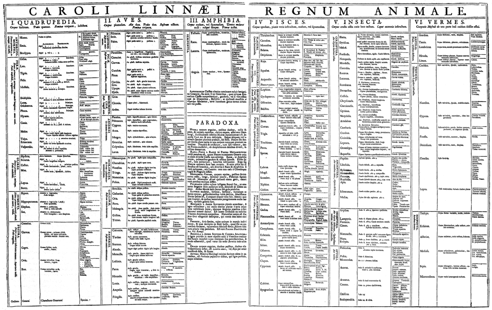


<!-------################ sd ##############-------->
## Sistema de classificação em zoologia

:::{.notes}
Em Botânica difere o filo, que vira divisão.
:::

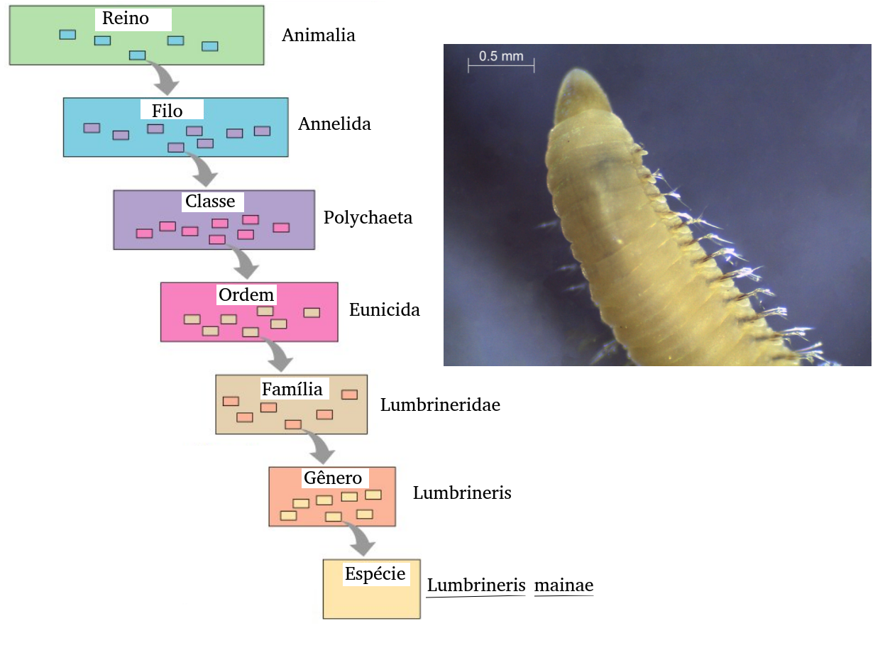

## {background-color="#6b5a59"}

<br><br><br><br>

::: {.r-fit-text}
Sistemática evolutiva de Darwin
:::


<!-------################ sd ##############-------->
## Darwin & Wallace e a origem das espécies por seleção natural (1858)


#### Inauguraram a escola da sistemática evolutiva: 

<br>

> "Os organismos descendem a partir de ancestrais comuns e o principal agente de mudança é a seleção natural."

<br>

> "Todos os organismos assemelham uns aos outros em graus descendentes, dessa forma eles podem ser classificados em grupos contidos em grupos."

<br>

> "...toda verdadeira classificação é genealógica."

<!-------################ sd ##############-------->
## A árvore da vida: todos somos parentes. {.scrollable}

:::box
“A árvore representa a melhor imagem das estruturas que sobrescrevem a hierarquia da vida.” 
:::

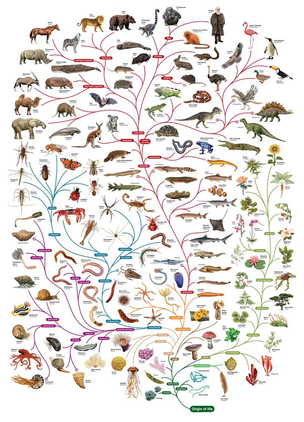{fig-align="center" width=80% height=80%}


<!-------################# sd #################-------->
## Processo de evolução: homologia e analogia {.smaller}

**Caracteres homólogos**: estrutura herdada a partir de um mesmo ancestral comum, com morfologia e origem embrionárias semelhantes, mas não necessariamente com a mesma função. Ex:   membros dianteiros dos diversos mamíferos.

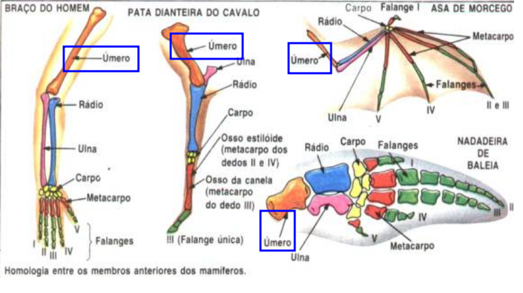

**Caracteres análogos**: estruturas análogas aparecem por *evolução  convergente*, ou seja, convergem para estruturas semelhantes e podem executar as mesmas funções, mas têm origens ancestrais distintas.

<!-------################# sd #################-------->
## Homologia é a similaridade devida ao ancentral comum.

Exemplos:

> - Asas de morcego e pássaros não são homólogas, pois o ancestral comum não possuia asas. As asas evoluíram independentemente.
- Pêlos de humanos e cachorros são homólogos, pois o ancestral comum possuia pêlos.
- Asas de borboletas e pássaros são homólogas?

<!-------################# sd #################-------->
## Sistemática evolutiva de Darwin

<br><br><br>

> Darwin incorporou na classificação o critério evolutivo de ancestralidade comum entre os taxa.

<br><br>

> O critério evolutivo de Darwin substituiu o critério morfologico de Lineu e teve enorme impacto nas árvores de classificação. 


## {background-color="#6b5a59"}

<br><br><br><br>

::: {.r-fit-text}
Sistemática filogenética de Hennig
:::


<!-------################# sd #################-------->
## Sistemática filogenética (ou cladística)

<br>

> Hennig (1966) introduziu a sistemática filogenética, ou cladística, baseada no conceito do **caráter 
derivado** que marca os grupos naturais.

> A história evolutiva dos grupos se tornou a base para a definição dos grupos. 

> É hora de aprender sobre dendrogramas e cladogramas.

<!-------################# sd #################-------->
## Dendrogramas e cladogramas

<br><br>

::: {.callout-caution}
Você vai encontrar muito por aí: ***DENDOGRAMA.***  
Isso é errado!  
O correto é: 

**DENDROGRAMA!**

*Dendros* significa árvore, em grego.
:::

<!-------################# sd #################-------->
## Cladograma e dendrograma

<br>

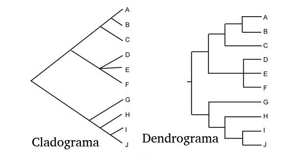


<!-------################# sd #################-------->
## Vantagem do cladograma: os comprimentos relativos dos ramos representam unidades de tempo. <br>

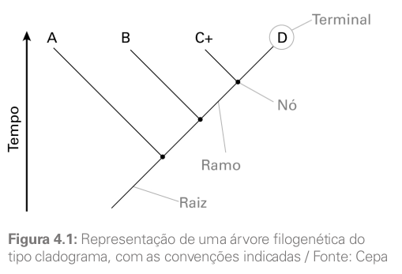


<!-------################# sd #################-------->
## Cladogênese e anagênese <br>

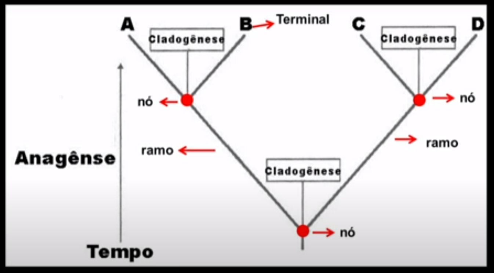

- Cladogênese é o aparecimento de um novo clado.
- Anagênese é o processo que leva à cladogênese.

<!-------################# sd #################-------->
## Processo de anagênese: especiação *alopátrica*, ocasionada por barreira geográfica (isolamento reprodutivo), como no ístmo do Panamá. {.smaller}

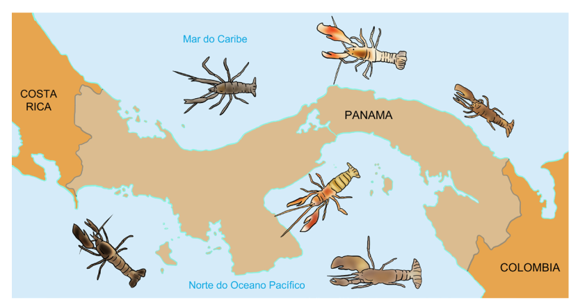

Existe também a especiação *simpátrica*, (mesma pátria), que é um isolamento reprodutivo sem separação geográfica.

## Grupos monofiléticos e polifiléticos 

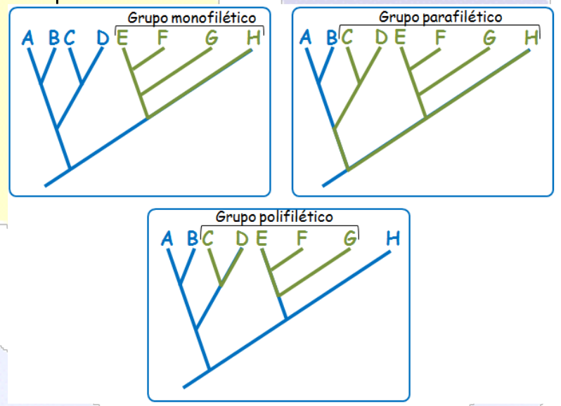

## Grupos monofiléticos 

<br>

> Grupo monofilético é aquele formado por um ancestral e todos os seus descendentes, ou seja, possui um *ancestral comum exclusivo.*

## Sinapomorfias e plesiomorfias {.smaller}

-   Sinapomorfia: estado derivado. Define grupo monofilético.
-   Plesiomorfia: estado ancestral. Define espécies que não fazem parte do grupo monofilético.
-   Autapomorfia: estado ancentral a partir de um nó que gerou uma plesiomorfia e uma sinapomorfia. 


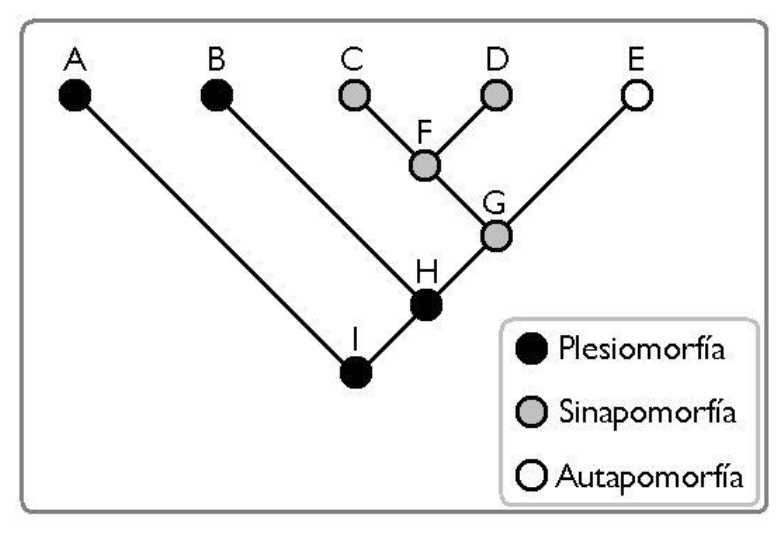

## Exemplos de sinapomorfia:

-   As penas distinguem as aves dos outros vertebrados e por isso é uma sinapomorfia das aves.
-   Os pêlos nos mamíferos os distinguem dos outros vertebrados.
-   A subclasse de insetos Pterygota é definida pela presença de asas. 
-   A presença de parapódios em poliquetas é uma sinapomorfia da classe em relação a outros Annelida.

## Resumo de cladística {.smaller}

<br>

> - Baseia-se no padrão de ancestralidade comum e modificação das espécies e não em mera similaridade morfológica.
-   Deve usar apenas caracteres derivados (apomórficos) compartilhados (sinapomórficos ou homólogos derivados).
-   Portanto, objetiva traçar a história evolutiva real, o 
padrão de descendência com modificação.
-   Cada ramo da árvore evolucionária é chamado "clado".
-   O “cladograma” é uma árvore evolucionária que considera apenas homologias que são caracteres derivados compartilhados (sinapomorfias), gerando grupos monofiléticos.


<!-------################# sd #################-------->
## Concluindo

<br><br>

> A sistemática filogenética (Hennig) se diferencia da sistemática evolutiva (Darwin) pela discriminação de caracteres primitivos (plesiomérficos) e derivados (apomórficos).

## {background-color="#6b5a59"}

<br><br><br><br>

::: {.r-fit-text}
Filogenia dos Metazoa
:::

<br>

Tarefa altamente complexa. 

##

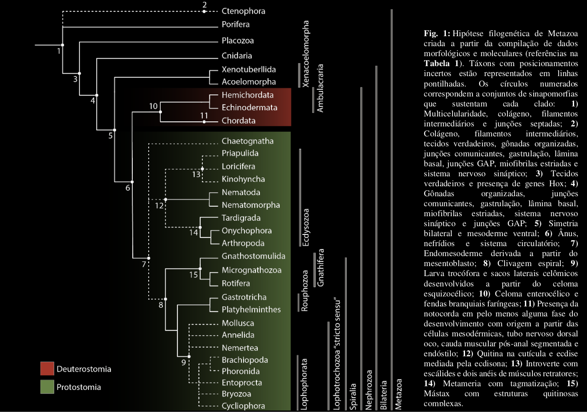


## {background-color="#6b5a59" .smaller}

<br><br><br><br>

::: {.r-fit-text}
Filogenia dos Annelida
:::

- É um dos filos com a filogenia menos conhecida.
- Recentes avanços em biologia molecular incluíram em Annelida outros filos menores: Pogonophora (Siboglinidae), Echiurida e Sipunculida.
- Biologia molecular revelou que Clitellata (Oligochaeta e Hirudines) são derivados da classe Polychaeta.

##


