## Filo Annelida{.smaller}

<br>

Divisão clássico pelos grupos:

-  **Oligochaeta**: minhocas terrestres e aquáticas;

-  **Polychaeta**: minhocas marinhas

-  **Hyrudinea**: sangue-suga. 

Características: protostômios, eucelomados e apresentam metameria (segmentação não- especializada); 


## Filo Annelida{.smaller}

<br>
Importância:  

-  **Oligoquetas**: aeração do solo, transporte de nutrientes para camadas mais profundas e como alimento na cadeia trófica florestal;
-  **Poliquetas**: estabilização do sedimento, alimento para outros invertebrados e peixes e também indicadores do tipo e grau de poluição em determinada área;
-  **Hirudinea**: aplicações medicinais como sangria por séculos. Recentes descobertas indicam que funcionavam!


## Filo Annelida{.smaller}

::: {style="font-size: 0.7em;"}

:::: {.columns}
::: {.column width="50%"}

-  **Polychaeta**  
Possuem numerosas cerdas, o que dá origem ao nome do grupo;  
Mm a metros;  
Parapódios;  
Dióicos;  
Região anterior podendo conter numerosos apêndices.  


-  **Oligochaeta**  
Possuem poucas cerdas;  
Homônomos;  
Estruturas sensoriais reduzidas;  
Sem parapódios;  
Hermafroditas, Clitelo;  
Região anterior sem apêndices.  


-  **Hirudinea**  
Número fixo de segmentos;  
Ventosas na região anterior e posterior;  
Região anterior  modificada para sugar;  
Sem cerdas e sem parapódios;  
 Heterônomos;  
 Clitelo.  

:::
::: {.column width="50%"}

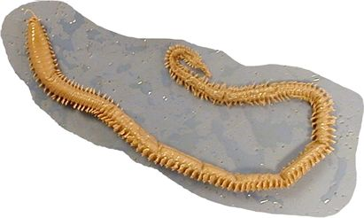{width=60% fig-align="center"}

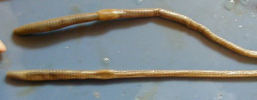{width=70% fig-align="center"}

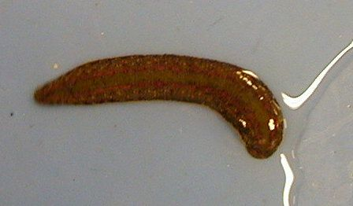{width=60% fig-align="center"}

:::
:::
::::


## Filo Annelida{.smaller}

-   A **sinapomorfia** que define o grupo dos Annelida em relação aos filos anteriores é o **metamerismo** (segmentação corporal), que foi o primeiro passo para a evolução das articulações dos artrópodos.

-   Devido ao sucesso evolutivo do **metamerismo**, Annelida tem hoje cerca de 16000 espécies (deve chegar a 100 mil) que invadiram todos os habitats onde existe algum grau de umidade.

-   Outra novidade evolutiva que os Anellida trouxeram foi o **celoma verdadeiro**.

::: callout-note
Para entender a importância do **metamerismo**, temos que saber o que é um organismo **celomado**.
:::

::: footer
```{r}
# Fake: serve só para que a data apareça no primeiro slide. PArou de funcionar
ss=Sys.Date()
```
:::

##  {background-color="#6b5a59"}

<br><br><br><br>

::: r-fit-text
Celomados
:::

## Celoma

-   Celoma é uma cavidade corporal preenchida pelo fluído celômico.\
-   Celoma atinge o maior estágio de desenvolvimento nos Annelida, por isso é **chamado de verdadeiro**.
-   Para ser um celoma verdadeiro, precisa ter origem **mesodérmica** e estar encerrado entre a ectoderme e a endoderme. Vermes inferiores, como platelmintos e Nematoda não possuem celoma verdadeiro.

## Celoma verdadeiro e pseudo-celoma.

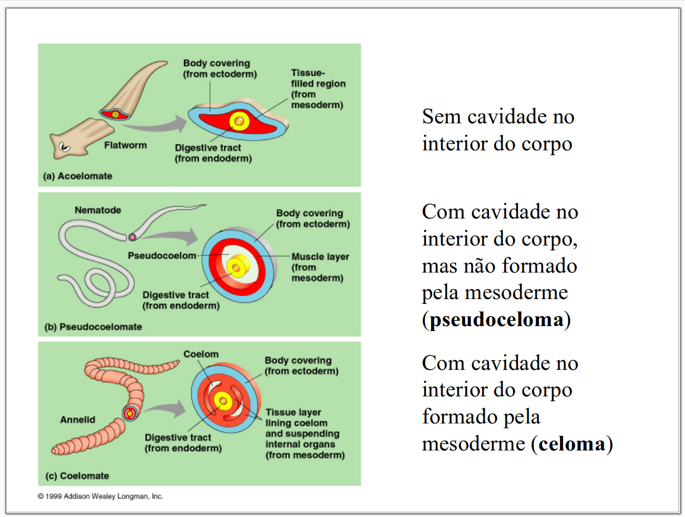

## Oligoqueta: estrutura interna com celoma verdadeiro.

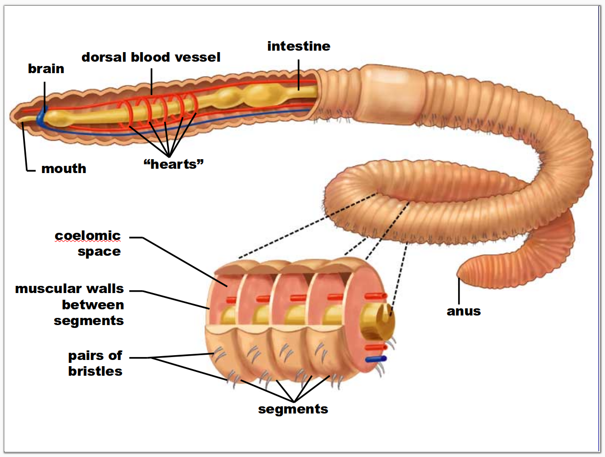

## Oligoqueta: estrutura interna com celoma verdadeiro.

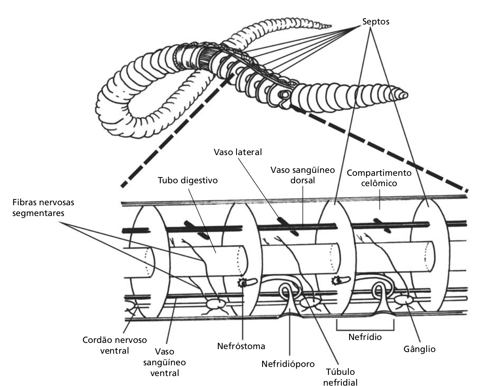


## Celoma

 -   O celoma atravessa longitudinalmente o indivíduo e é dividido nos anéis pelos **septos**.
 -   Celoma e as divisões dos anéis por septos fornecem uma espécie de galeria onde o fluído celômico pode circular por ação dos músculos, servindo como um **esqueleto hidrostático**, que permite a movimentação mais rápida e eficiente.
 -   Outras funções secundárias do celoma: movimentação independente da digestão, pois o celoma separa o tubo digestivo e parede corporal; atua como órgão excretor.

## Esqueleto hidrostático em ação

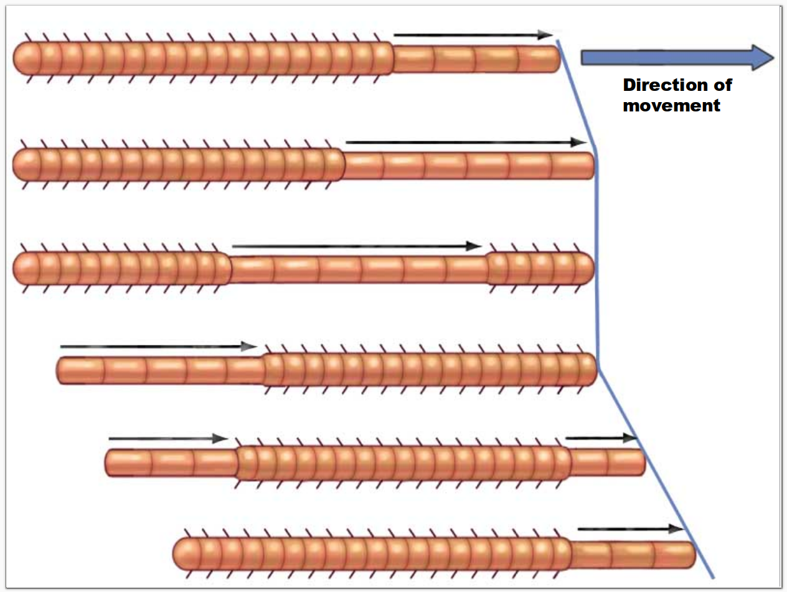

## Locomoção usando o esqueleto hidrostático: a) poliquetas; b) oliquetas; c) hirudinea. 

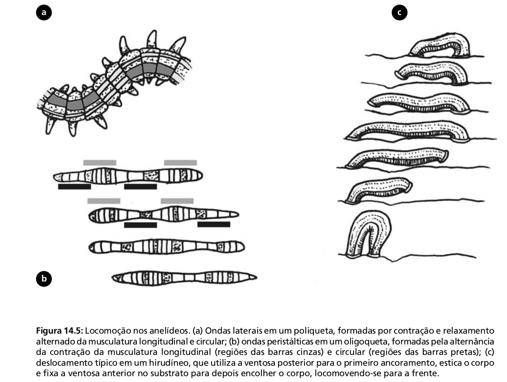

## Metameria e metâmeros

-   O aparecimento da **metameria** e do **esqueleto hidrostático** dotou os anelídeos um tipo único de locomoção, permitindo que novos ambientes fossem explorados, e assim apareceram os organismos **cavadores**.
-   A metameria também diminui o impacto de lesões, pois se alguns metâmeros estão danificados, outros podem suprir a falta (alguns poliquetas possuem capacidade de regeneração).


## Efeitos da metamerização
-   Os segmentos (metâmeros) repetem não só a pele e musculatura circular, mas os sistemas reprodutivos, nervoso, excretor e circulatório.
-   A metamerização é muitas vezes modificada por:
    - Restrição de certas estruturas a poucos movimentos
    - Alguns segmentos desenvolvem estruturas especiais, como para alimentação e respiração (brânquias) ou natação (escamas)
    - Alguns segmentos podem se fundir.


## Classificação dos Annelida {.smaller}

| **Classe**      | Clitelo[^1] | Parapódios[^2] | Cerdas[^3] | Ambiente                               | Espécies |
|-----------------|-------------|----------------|------------|----------------------------------------|----------|
| **Polychaeta**  | Não         | Sim            | Muitas     | Quase 100% marinho                     | 16000    |
| **Oligochaeta** | Sim         | Não            | Poucas     | Quase todos terrestres ou de água doce | 3500     |
| **Hirudinea**   | Sim         | Não            | Não        | Todos de água doce                     | 500      |

[^1]: Estrutura que auxilia na reprodução.

[^2]: Projeções laterais musculosas em cada segmento.

[^3]: Cerdas ou setas, originárias da parede do corpo ou do parapódio.


##  {background-color="#6b5a59"}

<br><br><br><br>

::: r-fit-text
Morfologia e fisiologia dos Annelida
:::

## Clitelo {.smaller}

Clitelo está presente em Oligochaeta e Hirudinea (chamos de Clitellata), representando por um anel glandular facilmente reconhecido na região anterior do corpo, que auxilia na reprodução produzindo muco para facilitar a cópula.  

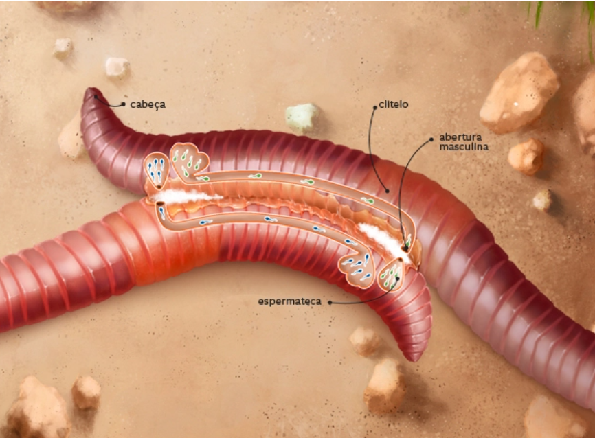

## Sistema circulatório

-   Algumas espécies possudem pigmentos respiratórios no sangue, como a hemoglobina em *Euzonus*, um poliqueta que habita as praias do Cassino.  
-   Os anelídeos possuem dois vasos sanguíneos principais, o dorsal e o ventral. 

## Sistema nervoso e órgãos dos sentidos

-   O sistema nervoso dos anelídeos é formado por um cordão nervoso ventral e um "cérebro", que é somente uma agregação de tecido nervoso na região anterior.
-   Poliquetas possuem olhos, mas não produzem imagens, apenas reagem às alterações de luminosidade.
-   Diversos quimiorreceptores estão espalhados pelo corpo dos anelídeos.
-   Gânglios se repetem em cada segmento.


## Sistema nervoso e órgãos dos sentidos

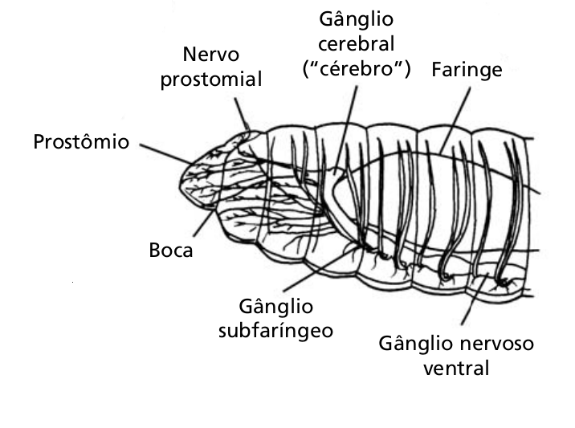

## Sistema digestivo

-   O sistema digestivo é formado por um tubo digestivo longitudinal que se estende ao longo do corpo. Começa na boca e termina no ânus. 
-   Não é segmentado.
-   O alimento é movimentado pelas contrações peristálticas da musculatura corporal.
- Oligochaeta tem o trato digestivo mais especializado, com boca, faringe, esôfago, papo, moela, intestino e ânus

## Sistema digestivo

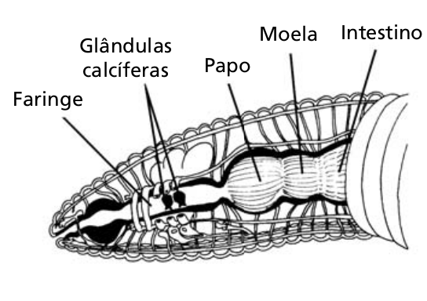


## Sistema excretor

-   Há uma par de metanefrídeos em cada segmento.
-   A função dos metanefrídeos é retirar restos metabólicos do fluido celômico e do sangue.  

## Respiração

-   A troca gasosa ocorre através da parede corporal, que é, em geral, bastante permeável. 
-   Em alguns poliquetas, é possível encontrar brânquias em alguns parapódios.
-   Em poliquetas tubículas, existem brânquias nos tentáculos.

## Reprodução de oligoquetas

-   Oligoquetas (Clitellata em geral) são monóicos (hermafroditas), mas fazem reprodução cruzada. Não libera gametas no ambiente, mas fecunda os ovos dentro de um casulo que é liberado no ambiente.


## Reprodução de poliquetas
-   Todos possuem larva trocófora.  

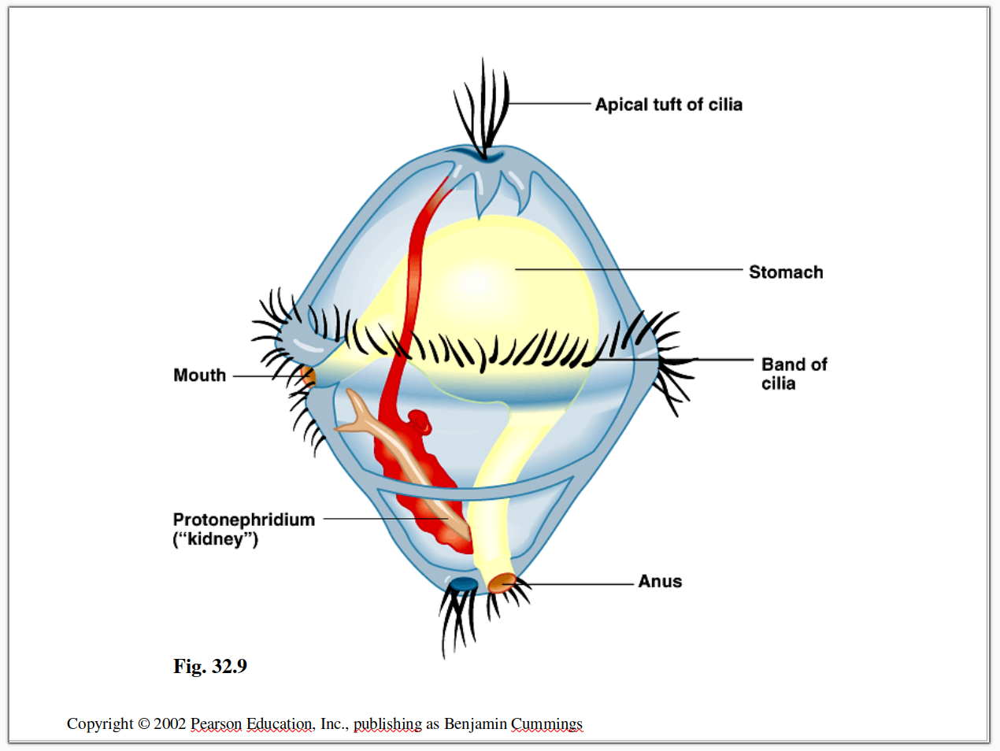


## Reprodução de poliquetas

-   Poliquetas são dióicos (sexos separados) e liberam seus gametas na água.
-   A fertilização dos poliquetas errantes ocorre muitas vezes na coluna d'agua, liberando ovos que eclodem em larvas pelágicas, que em juvenil habitarão a meiofauna (próximo slide). 

## Reprodução dos poliquetas

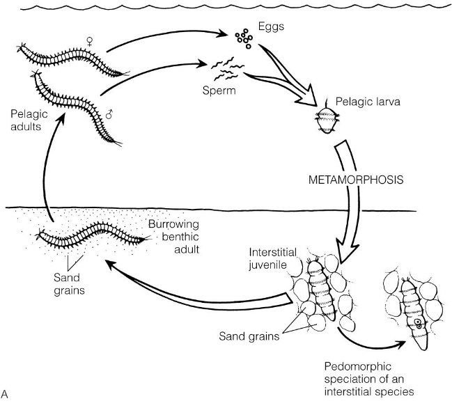

