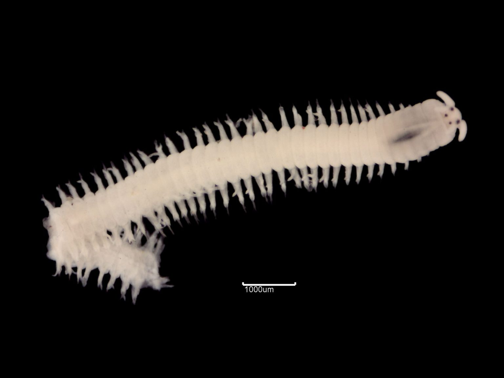
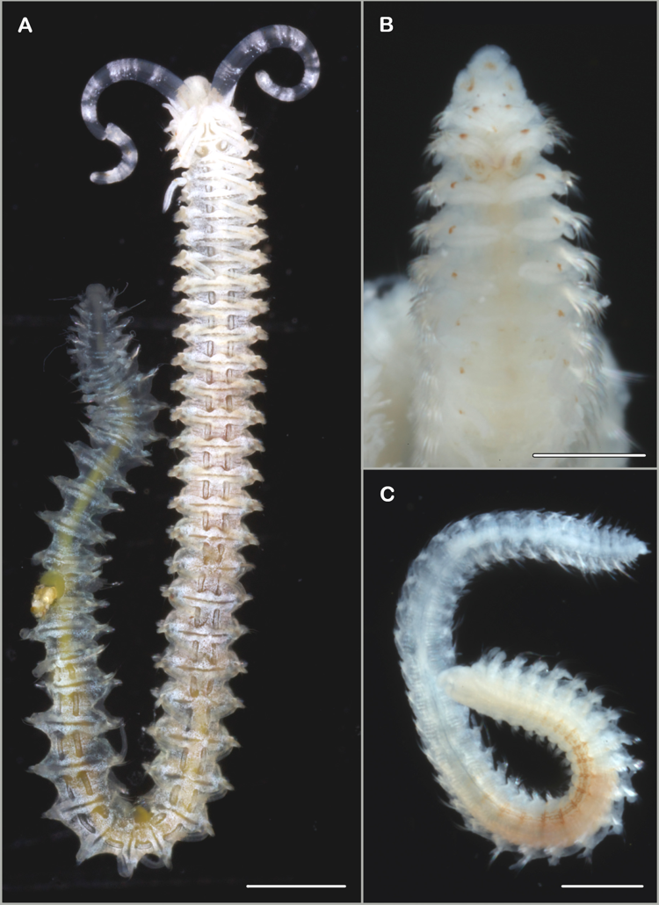
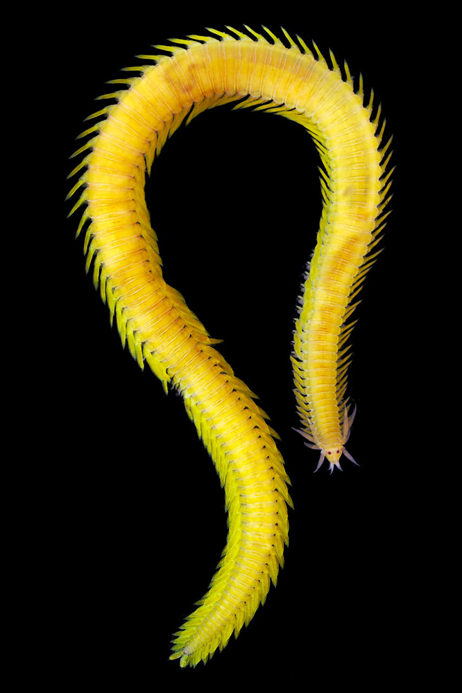
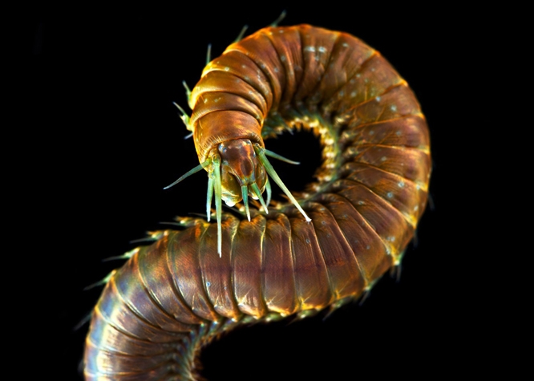
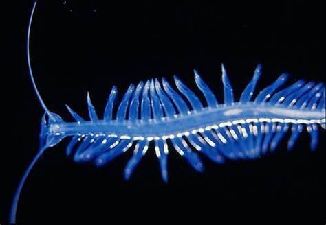
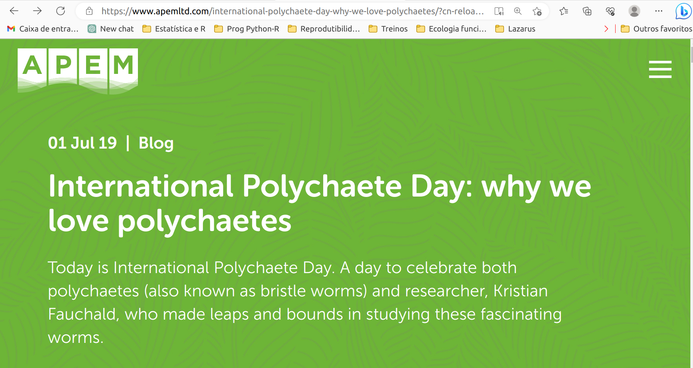

## Gêneros de poliquetas com nomes de entidades femininas gregas:

  

:::: {.columns}
::: {.column width="30%"}
:::
::: {.column width="54%"}
Aphrodite  
Eunice  
Isolda  
Eulalia   
Palola  
Nereida   
:::
::: {.column width="33%"}
:::
:::: 

## 

##

##

##

##

##

##

##

##

##

##

##

##

##

##

##

